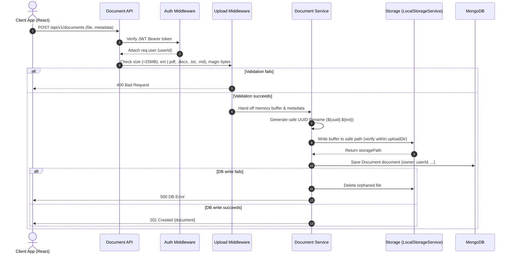

# VaultIQ Architecture Documentation (Phases 1 & 2)

## 1. System Overview

VaultIQ is an enterprise-grade document intelligence and organizational knowledge platform designed to index, search, and synthesize organizational knowledge with source citations and fine-grained access control.

- **Phase 1**: Production architecture, security foundation, authentication lifecycle, and responsive design system.
- **Phase 2**: Document management, secure storage abstraction, multipart file uploads, metadata persistence, and user ownership isolation.

```
                  ┌──────────────────────────────────────────────┐
                  │                 Client Tier                  │
                  │   React 18 + TypeScript + Tailwind + Vite    │
                  └──────────────────────┬───────────────────────┘
                                         │ HTTPS / REST (JSON & Multipart)
                                         ▼
                  ┌──────────────────────────────────────────────┐
                  │                 Gateway Tier                 │
                  │   Security Headers (Helmet) + CORS + Limiter │
                  └──────────────────────┬───────────────────────┘
                                         │
                                         ▼
┌─────────────────────────────────────────────────────────────────────────────────┐
│                           Backend Service Tier (Express)                        │
│                                                                                 │
│   ┌────────────────┐       ┌────────────────┐       ┌───────────────────────┐   │
│   │ Route Layer    │ ───►  │ Validation     │ ───►  │ Authentication        │   │
│   │ (/api/v1/...)  │       │ (Zod Schemas)  │       │ Middleware (JWT)      │   │
│   └────────────────┘       └────────────────┘       └───────────┬───────────┘   │
│                                                                 │               │
│                            ┌────────────────────────────────────┴───────────┐   │
│                            │ Multer & File Signature / Magic-Byte Checker   │   │
│                            └────────────────────┬───────────────────────────┘   │
│                                                 │                               │
│   ┌────────────────┐       ┌────────────────┐   ▼                               │
│   │ Response / DTO │ ◄───  │ Service Layer  │ (DocumentService / AuthService)  │
│   │ Layer          │       │                │                                   │
│   └────────────────┘       └────────┬───────┘                                   │
└─────────────────────────────────────┼───────────────────────────────────────────┘
                                      │
                   ┌──────────────────┴──────────────────┐
                   │                                     │
                   ▼                                     ▼
     ┌───────────────────────────┐         ┌───────────────────────────┐
     │   Storage Abstraction     │         │       Database Tier       │
     │   (IStorageService)       │         │        MongoDB ORM        │
     │   LocalStorageService     │         │   (User & Document Models)│
     │   ./uploads (Docker vol)  │         │                           │
     └───────────────────────────┘         └───────────────────────────┘
```

---

## 2. Request Lifecycle & Document Flow

All incoming API requests adhere to a strict, directional request-response flow:

$$\text{Client} \longrightarrow \text{REST API} \longrightarrow \text{Authentication} \longrightarrow \text{Document Service} \longrightarrow \text{Storage Abstraction} \longrightarrow \text{Local Storage / MongoDB}$$

1. **Routing Layer (`src/routes/api/v1/document.routes.ts`)**:
   Defines URL paths, HTTP verbs, and mounts middleware chains. `GET /api/v1/documents/stats` is explicitly registered before `GET /api/v1/documents/:id` to avoid route shadowing.
2. **Authentication Middleware (`src/middleware/auth.middleware.ts`)**:
   Extracts and verifies JWT Bearer tokens, establishing `req.user.userId`.
3. **Upload Middleware (`src/middleware/upload.middleware.ts`)**:
   Enforces a strict 25 MB file limit, allows only `.pdf`, `.docx`, `.txt`, `.md`, and performs magic-byte validation:
   - PDF: starts with `%PDF-` (`0x25 0x50 0x44 0x46 0x2D`)
   - DOCX: starts with PK header (`0x50 0x4B 0x03 0x04`)
   - TXT / MD: UTF-8 encoding check, rejects NUL control bytes (`0x00`)
4. **Validation Middleware (`src/middleware/validate.middleware.ts`)**:
   Parses query parameters (pagination, search, status, sort) and path parameters against Zod schemas.
5. **Document Service Layer (`src/services/document.service.ts`)**:
   Enforces user ownership isolation. All database queries bind `owner: new Types.ObjectId(userId)`.
6. **Storage Abstraction (`src/storage/local.storage.ts`)**:
   Writes binary files to disk using safe UUID identifiers (`${randomUUID()}${ext}`). Prevents path traversal via strict `resolvePath()` checks.
7. **Database Model (`src/models/Document.ts`)**:
   Saves metadata in MongoDB. If database save fails, stored files are automatically cleaned up.

---

## 3. Database Schema Models

### User Model (`User.ts`)
```typescript
interface IUser {
  _id: Types.ObjectId;
  name: string;
  email: string;           // Indexed, unique, lowercase, trimmed
  passwordHash: string;    // Excluded from query projections (select: false)
  role: 'USER' | 'ADMIN';  // Role-based access control
  avatar?: string;
  createdAt: Date;
  updatedAt: Date;
}
```

### Document Model (`Document.ts`)
```typescript
interface IDocument {
  _id: Types.ObjectId;
  owner: Types.ObjectId;   // Foreign key ref to User, indexed
  originalName: string;    // Preserved for display & download
  storedName: string;      // Safe generated UUID filename
  mimeType: string;        // e.g. application/pdf
  extension: string;       // pdf, docx, txt, md
  size: number;            // File size in bytes
  storagePath: string;     // Internal storage reference
  status: 'UPLOADED' | 'PROCESSING' | 'PROCESSED' | 'FAILED';
  metadata: {
    title?: string;
    description?: string;
    tags?: string[];
  };
  uploadedAt: Date;
  createdAt: Date;
  updatedAt: Date;
}
```

- **Compound Indexes**:
  - `{ owner: 1, uploadedAt: -1 }`: Fast retrieval of user's latest documents
  - `{ owner: 1, originalName: 1 }`: Accelerated sorting and exact name lookups
  - `{ owner: 1, status: 1 }`: Fast status filtering
- **Multi-Field Search**: `$or` queries across `originalName`, `metadata.title`, `metadata.description`, and `metadata.tags`.

---

## 4. Document Ingestion Flow



---

## 5. Security Controls Summary

1. **Path Traversal Defense**: All storage paths are resolved through canonical absolute paths and checked with `path.relative(baseDir, resolved).startsWith('..')`.
2. **Ownership Isolation**: Users cannot view, download, or delete documents belonging to another user. Attempts return `404 Not Found` to prevent metadata leakage.
3. **MIME-Type & Magic-Byte Validation**: Files are checked against cryptographic file headers before disk writes.
4. **File Size Enforcement**: 25 MB limit enforced in Multer and storage services.
5. **No Secrets in Repository**: Secrets and local paths are isolated in `.env` (ignored by Git) with `.env.example` as a template.

---

## 6. Future Roadmap Context

```
 Phase 1: Foundation (Complete)
     ↓
 Phase 2: Document Management & Secure Storage (Complete)
     ↓
 Phase 3: Document Processing & Chunking (Next)
     ↓
 Phase 4: Vector Search & Hybrid Retrieval
     ↓
 Phase 5: RAG & AI Knowledge Assistant
```
