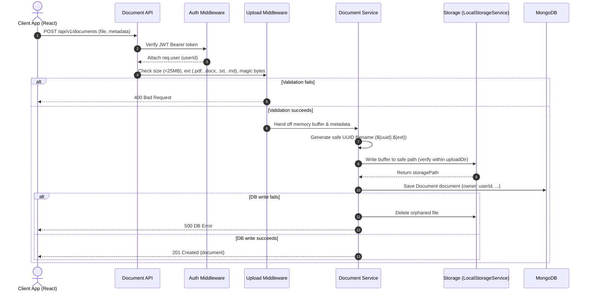

# VaultIQ Architecture Documentation (Phases 1 & 2)

## 1. System Overview

VaultIQ is an enterprise-grade document intelligence and organizational knowledge platform designed to index, search, and synthesize organizational knowledge with source citations and fine-grained access control.

- **Phase 1**: Production architecture, security foundation, authentication lifecycle, and responsive design system.
- **Phase 2**: Document management, secure storage abstraction, multipart file uploads, metadata persistence, and user ownership isolation.

```
                  ┌──────────────────────────────────────────────┐
                  │                 Client Tier                  │
                  │   React 18 + TypeScript + Tailwind + Vite    │
                  └──────────────────────┬───────────────────────┘
                                         │ HTTPS / REST (JSON & Multipart)
                                         ▼
                  ┌──────────────────────────────────────────────┐
                  │                 Gateway Tier                 │
                  │   Security Headers (Helmet) + CORS + Limiter │
                  └──────────────────────┬───────────────────────┘
                                         │
                                         ▼
┌─────────────────────────────────────────────────────────────────────────────────┐
│                           Backend Service Tier (Express)                        │
│                                                                                 │
│   ┌────────────────┐       ┌────────────────┐       ┌───────────────────────┐   │
│   │ Route Layer    │ ───►  │ Validation     │ ───►  │ Authentication        │   │
│   │ (/api/v1/...)  │       │ (Zod Schemas)  │       │ Middleware (JWT)      │   │
│   └────────────────┘       └────────────────┘       └───────────┬───────────┘   │
│                                                                 │               │
│                            ┌────────────────────────────────────┴───────────┐   │
│                            │ Multer & File Signature / Magic-Byte Checker   │   │
│                            └────────────────────┬───────────────────────────┘   │
│                                                 │                               │
│   ┌────────────────┐       ┌────────────────┐   ▼                               │
│   │ Response / DTO │ ◄───  │ Service Layer  │ (DocumentService / AuthService)  │
│   │ Layer          │       │                │                                   │
│   └────────────────┘       └────────┬───────┘                                   │
└─────────────────────────────────────┼───────────────────────────────────────────┘
                                      │
                   ┌──────────────────┴──────────────────┐
                   │                                     │
                   ▼                                     ▼
     ┌───────────────────────────┐         ┌───────────────────────────┐
     │   Storage Abstraction     │         │       Database Tier       │
     │   (IStorageService)       │         │        MongoDB ORM        │
     │   LocalStorageService     │         │   (User & Document Models)│
     │   ./uploads (Docker vol)  │         │                           │
     └───────────────────────────┘         └───────────────────────────┘
```

---

## 2. Request Lifecycle & Document Flow

All incoming API requests adhere to a strict, directional request-response flow:

$$\text{Client} \longrightarrow \text{REST API} \longrightarrow \text{Authentication} \longrightarrow \text{Document Service} \longrightarrow \text{Storage Abstraction} \longrightarrow \text{Local Storage / MongoDB}$$

1. **Routing Layer (`src/routes/api/v1/document.routes.ts`)**:
   Defines URL paths, HTTP verbs, and mounts middleware chains. `GET /api/v1/documents/stats` is explicitly registered before `GET /api/v1/documents/:id` to avoid route shadowing.
2. **Authentication Middleware (`src/middleware/auth.middleware.ts`)**:
   Extracts and verifies JWT Bearer tokens, establishing `req.user.userId`.
3. **Upload Middleware (`src/middleware/upload.middleware.ts`)**:
   Enforces a strict 25 MB file limit, allows only `.pdf`, `.docx`, `.txt`, `.md`, and performs magic-byte validation:
   - PDF: starts with `%PDF-` (`0x25 0x50 0x44 0x46 0x2D`)
   - DOCX: starts with PK header (`0x50 0x4B 0x03 0x04`)
   - TXT / MD: UTF-8 encoding check, rejects NUL control bytes (`0x00`)
4. **Validation Middleware (`src/middleware/validate.middleware.ts`)**:
   Parses query parameters (pagination, search, status, sort) and path parameters against Zod schemas.
5. **Document Service Layer (`src/services/document.service.ts`)**:
   Enforces user ownership isolation. All database queries bind `owner: new Types.ObjectId(userId)`.
6. **Storage Abstraction (`src/storage/local.storage.ts`)**:
   Writes binary files to disk using safe UUID identifiers (`${randomUUID()}${ext}`). Prevents path traversal via strict `resolvePath()` checks.
7. **Database Model (`src/models/Document.ts`)**:
   Saves metadata in MongoDB. If database save fails, stored files are automatically cleaned up.

---

## 3. Database Schema Models

### User Model (`User.ts`)
```typescript
interface IUser {
  _id: Types.ObjectId;
  name: string;
  email: string;           // Indexed, unique, lowercase, trimmed
  passwordHash: string;    // Excluded from query projections (select: false)
  role: 'USER' | 'ADMIN';  // Role-based access control
  avatar?: string;
  createdAt: Date;
  updatedAt: Date;
}
```

### Document Model (`Document.ts`)
```typescript
interface IDocument {
  _id: Types.ObjectId;
  owner: Types.ObjectId;   // Foreign key ref to User, indexed
  originalName: string;    // Preserved for display & download
  storedName: string;      // Safe generated UUID filename
  mimeType: string;        // e.g. application/pdf
  extension: string;       // pdf, docx, txt, md
  size: number;            // File size in bytes
  storagePath: string;     // Internal storage reference
  status: 'UPLOADED' | 'PROCESSING' | 'PROCESSED' | 'FAILED';
  metadata: {
    title?: string;
    description?: string;
    tags?: string[];
  };
  uploadedAt: Date;
  createdAt: Date;
  updatedAt: Date;
}
```

- **Compound Indexes**:
  - `{ owner: 1, uploadedAt: -1 }`: Fast retrieval of user's latest documents
  - `{ owner: 1, originalName: 1 }`: Accelerated sorting and exact name lookups
  - `{ owner: 1, status: 1 }`: Fast status filtering
- **Multi-Field Search**: `$or` queries across `originalName`, `metadata.title`, `metadata.description`, and `metadata.tags`.

---

## 4. Document Ingestion Flow



---

## 6. Document Processing & Text Extraction Pipeline (Phase 3)

VaultIQ Phase 3 establishes a robust, decoupled text extraction pipeline converting uploaded document binaries into normalized plain text.

```
                    ┌────────────────────────────┐
                    │ POST /:id/process endpoint │
                    └─────────────┬──────────────┘
                                  │ Atomic update: status -> 'PROCESSING'
                                  ▼
                    ┌────────────────────────────┐
                    │    IStorageService         │
                    │    .getBuffer(storagePath) │
                    └─────────────┬──────────────┘
                                  │ Binary Buffer
                                  ▼
                    ┌────────────────────────────┐
                    │     ProcessorFactory       │
                    └──────┬──────┬──────┬───────┘
                           │      │      │       │
          ┌────────────────┘      │      │       └────────────────┐
          ▼                       ▼      ▼                        ▼
  ┌──────────────┐        ┌──────────────┐      ┌───────────────┐ ┌────────────────┐
  │ PdfProcessor │        │DocxProcessor │      │ TextProcessor │ │ TextProcessor  │
  │ (pdf-parse)  │        │  (mammoth)   │      │   (.txt)      │ │   (.md)        │
  └───────┬──────┘        └──────┬───────┘      └───────┬───────┘ └────────┬───────┘
          │                      │                      │                  │
          └──────────────────────┴──────────┬───────────┴──────────────────┘
                                            │ Raw text
                                            ▼
                              ┌───────────────────────────┐
                              │      TextNormalizer       │
                              │ - Normalize CRLF -> LF    │
                              │ - Strip non-printable ASCII│
                              │ - Collapse multi-spaces   │
                              │ - Max 2 newlines (paras)  │
                              │ - Count chars & words     │
                              └─────────────┬─────────────┘
                                            │
                                            ▼
                             Size check: <= MAX_EXTRACTED_TEXT_SIZE_MB (10 MB)
                                            │
                     ┌──────────────────────┴──────────────────────┐
                     ▼                                             ▼
          Success: status -> 'PROCESSED'               Failure: status -> 'FAILED'
          content: { text, characterCount,             processingError: sanitized message
                     wordCount, pageCount, ... }
```

---

## 7. Security Controls Summary

1. **Path Traversal Defense**: All storage paths are resolved through canonical absolute paths and checked with `path.relative(baseDir, resolved).startsWith('..')`.
2. **Ownership Isolation**: Users cannot view, download, process, or delete documents belonging to another user. Attempts return `404 Not Found` to prevent metadata leakage.
3. **MIME-Type & Magic-Byte Validation**: Files are checked against cryptographic file headers before disk writes.
4. **File Size Enforcement**: 25 MB file upload limit and 10 MB post-normalization extracted text limit.
5. **Safe Error Messages**: Error stack traces, internal paths, and system details are stripped before reaching API responses or the frontend.
6. **No Secrets in Repository**: Secrets and local paths are isolated in `.env` (ignored by Git) with `.env.example` as a template.

---

---

## 8. Semantic / Vector Search Architecture (Phase 4)

VaultIQ Phase 4 introduces boundary-aware text chunking and vector embeddings with MongoDB Atlas Vector Search as primary and cosine similarity fallback:

```
[Normalized Text]
       │
       ▼
[TextChunker] ──► Boundary-aware sliding window (size: 1000 chars, overlap: 150 chars)
       │
       ▼
[EmbeddingService] ──► OpenAI text-embedding-3-small (1536 dims) or Deterministic Mock
       │
       ▼
[DocumentChunk Collection] ──► Stored with parent document reference & owner isolation
       │
       ▼
[SearchService] ──► Atlas $vectorSearch (Production) or Local Cosine Fallback (Dev/Test)
```

---

## 9. Grounded RAG & AI Assistant Pipeline (Phase 5)

VaultIQ Phase 5 transforms Phase 4 semantic retrieval into a secure, grounded conversational intelligence platform:

```
                      ┌────────────────────────────┐
                      │    User Chat Question      │
                      └─────────────┬──────────────┘
                                    │
                                    ▼
                      ┌────────────────────────────┐
                      │  Authenticated ChatService │
                      │  (Enforces User Ownership) │
                      └─────────────┬──────────────┘
                                    │
                                    ▼
                      ┌────────────────────────────┐
                      │    SearchService (Phase 4) │
                      │ .searchSemantic(userId, q) │
                      └─────────────┬──────────────┘
                                    │ Raw Chunks
                                    ▼
                      ┌────────────────────────────┐
                      │      ContextBuilder        │
                      │ - Filter score >= 0.5      │
                      │ - Sort descending          │
                      │ - Enforce cap <= 6000 chars│
                      └─────────────┬──────────────┘
                                    │
                    ┌───────────────┴───────────────┐
                    │ Insufficient Evidence?        │
                    ├───────────────────────────────┤
                    │ Yes ──► Controlled Fallback   │
                    │         (Zero Hallucination)  │
                    │ No                            │
                    └───────────────┬───────────────┘
                                    │ Bounded Evidence
                                    ▼
                      ┌────────────────────────────┐
                      │       PromptBuilder        │
                      │ - Strict system role       │
                      │ - Enclosed in <context>    │
                      │ - Prompt injection defense │
                      │ - Mandatory citations [Doc]│
                      └─────────────┬──────────────┘
                                    │
                                    ▼
                      ┌────────────────────────────┐
                      │        LLM Service         │
                      │ (OpenAI gpt-4o-mini / Mock)│
                      └─────────────┬──────────────┘
                                    │
                                    ▼
                      ┌────────────────────────────┐
                      │  Message Persistence & DTO │
                      │ - Save user message        │
                      │ - Save assistant message   │
                      │ - Attach verified sources  │
                      │ - Cascade deletion support │
                      └────────────────────────────┘
```

### Database Models (Phase 5)
- **`Conversation`**: `_id`, `owner` (ref User), `title`, `metadata`, `createdAt`, `updatedAt`.
  - Compound index: `{ owner: 1, updatedAt: -1 }`.
- **`Message`**: `_id`, `conversation` (ref Conversation), `role` (`'user'` | `'assistant'`), `content`, `sources` (array of `{ documentId, originalName, chunkIndex, similarityScore, snippet }`), `tokenUsage`, `createdAt`.
  - Compound index: `{ conversation: 1, createdAt: 1 }`.

---

## 10. Enterprise Collaboration & Access Governance (Phase 6)

VaultIQ Phase 6 transitions the application into an organization-aware enterprise knowledge platform with hierarchical tenancy, RBAC authorization, and immutable audit logs:

```
                      ┌────────────────────────────┐
                      │  Client Request + JWT      │
                      │  Header: x-organization-id │
                      └─────────────┬──────────────┘
                                    │
                                    ▼
                      ┌────────────────────────────┐
                      │    resolveOrgContext       │
                      │ 1. Validate org ID format  │
                      │ 2. Find Org in DB          │
                      │ 3. Verify Membership in DB │ (Never trust header alone!)
                      │ 4. Attach req.orgMember    │
                      └─────────────┬──────────────┘
                                    │
                     ┌──────────────┴──────────────┐
                     ▼                             ▼
       ┌───────────────────────────┐ ┌───────────────────────────┐
       │   requireOrgPermission    │ │   AuthorizationService    │
       │ Route-level guard checks  │ │ Centralized Matrix:       │
       │ permission against role   │ │ OWNER > ADMIN > EDITOR    │
       │ (e.g. 'audit.read')       │ │ > VIEWER                  │
       └───────────────────────────┘ └─────────────┬─────────────┘
                                                   │
                                                   ▼
       ┌─────────────────────────────────────────────────────────┐
       │           Pre-Retrieval Authorization (Search)          │
       │  Both Atlas $vectorSearch and Local Cosine pre-filter:  │
       │  { organizationId: orgId,                               │
       │    $or: [{ visibility: 'ORGANIZATION' },                │
       │          { owner: userId }] }                           │
       │  Unauthorized chunks are NEVER retrieved or ranked      │
       └───────────────────────────┬─────────────────────────────┘
                                   │
                                   ▼
       ┌─────────────────────────────────────────────────────────┐
       │             Immutable Append-Only Audit Logging         │
       │  AuditService.log({ action, actorId, organizationId,    │
       │                     resourceType, metadata, ip, ua })   │
       │  - Strips passwords, API keys, tokens, embeddings       │
       │  - Indexed by { organizationId: 1, createdAt: -1 }      │
       └─────────────────────────────────────────────────────────┘
```

### RBAC Permission Matrix

| Permission | OWNER | ADMIN | EDITOR | VIEWER |
|---|:---:|:---:|:---:|:---:|
| `organization.read` | ✅ | ✅ | ✅ | ✅ |
| `organization.update` | ✅ | ✅ | ❌ | ❌ |
| `organization.delete` | ✅ | ❌ | ❌ | ❌ |
| `organization.member.read` | ✅ | ✅ | ✅ | ✅ |
| `organization.member.invite` | ✅ | ✅ | ❌ | ❌ |
| `organization.member.update` | ✅ | ✅ | ❌ | ❌ |
| `organization.member.remove` | ✅ | ✅ | ❌ | ❌ |
| `document.read` | ✅ | ✅ | ✅ | ✅ |
| `document.create` | ✅ | ✅ | ✅ | ❌ |
| `document.update` | ✅ | ✅ | ✅ | ❌ |
| `document.delete` | ✅ | ✅ | ❌ | ❌ |
| `chat.read` | ✅ | ✅ | ✅ | ✅ |
| `chat.create` | ✅ | ✅ | ✅ | ✅ |
| `audit.read` | ✅ | ✅ | ❌ | ❌ |

### Database Models (Phase 6)
- **`Organization`**: `_id`, `name`, `slug` (unique indexed), `ownerId` (ref User), `timestamps`.
- **`OrganizationMember`**: `_id`, `organizationId` (ref Organization), `userId` (ref User), `role` (`OWNER`, `ADMIN`, `EDITOR`, `VIEWER`), `joinedAt`. Compound unique index: `{ organizationId: 1, userId: 1 }`.
- **`AuditLog`**: `_id`, `organizationId`, `actorId`, `action`, `resourceType`, `resourceId`, `metadata` (secret-stripped), `ipAddress`, `userAgent`, `createdAt`. Compound index: `{ organizationId: 1, createdAt: -1 }`.
- **`Document` (Augmented)**: `organizationId` (ref Organization), `visibility` (`'ORGANIZATION'` | `'PRIVATE'`). Compound indexes: `{ organizationId: 1, createdAt: -1 }`, `{ organizationId: 1, visibility: 1 }`.
- **`DocumentChunk` (Augmented)**: `organizationId` (ref Organization). Index: `{ organizationId: 1, document: 1 }`.
- **`Conversation` (Augmented)**: `organizationId` (ref Organization). Index: `{ organizationId: 1, owner: 1, updatedAt: -1 }`.

---

## 11. Multi-Phase Progression Context

```
 Phase 1: Foundation (Complete ✅)
     ↓
 Phase 2: Document Management & Secure Storage (Complete ✅)
     ↓
 Phase 3: Document Processing & Text Extraction (Complete ✅)
     ↓
 Phase 4: Semantic / Vector Search (Complete ✅)
     ↓
 Phase 5: Grounded RAG & AI Knowledge Assistant (Complete ✅)
     ↓
 Phase 6: Enterprise Collaboration & Access Governance (Complete ✅)
     ↓
 Phase 7: Testing, Security & Production Deployment (Next Phase)
```
